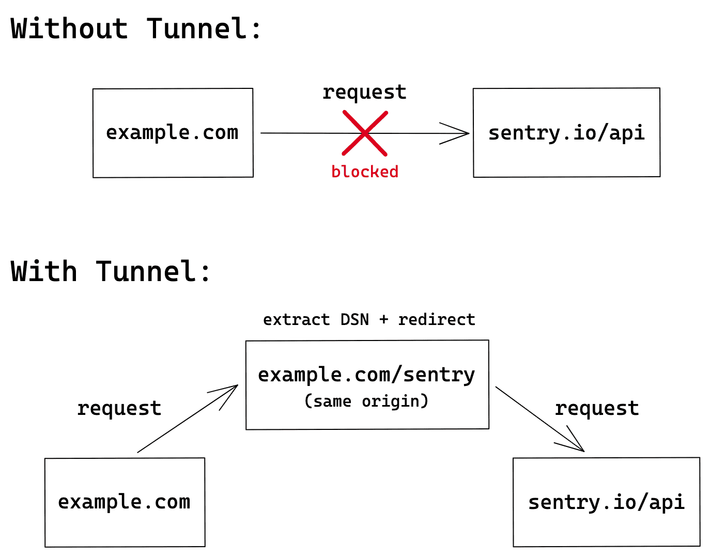

# nginx-sentry-proxy 
Ad blocker bypass for Sentry.Allows you to bypass ads using reverse proxy.

* default port: <b>8000</b>
*  [setup sentry client :](https://docs.sentry.io/platforms/javascript/troubleshooting/) 


### run :
```bash
docker pull ghcr.io/lad-tech/nginx-sentry-proxy:latest
```
